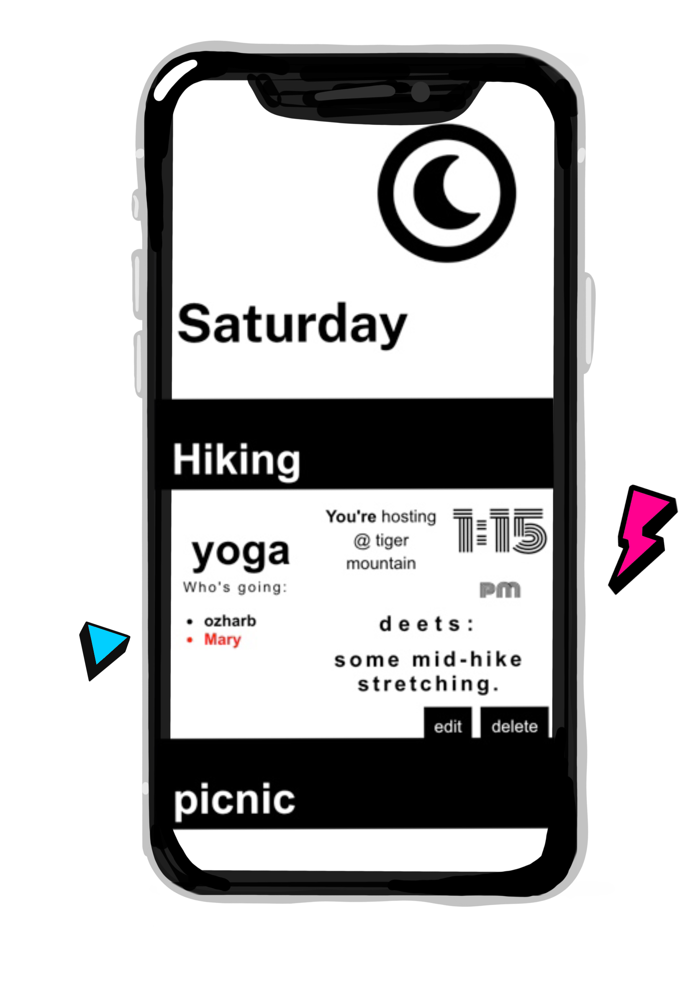

# WEkend
A social app for posting casual weekend events and activities for your friends to see.

This repo is the front-end client, built in React.  You can see the app live at [tps://wekend-client-ozharb.vercel.app/days/]

The app is meant for mobile use, but scales for desktop viewing.

To check out the app, I suggest you create a dummy account so you can see the onboarding experience.  But if you just want to view what the program looks like, you can use the demo account.

#### Demo Account Details

* user name: Demo
* password: Demo2021!

## Introduction

WEkend is a friendly weekend planning app for friends. Connect with friends, post events, and see what others are up to. 

Simple, quick, and stylish.

## App Screenshots

## Technology

#### Front End

* React
  * Create React App
  * React Router
* HTML5
* CSS3 (scratch - no frameworks)

#### Testing

* Jest (screen captures & smoke tests)

#### Production

* Deployed via Vercel

## Getting Started

Run `npm install` to load dependencies

Run `npm test` to ensure a stable build

The repo for the backend end server I've developed is available at https://github.com/ozharb/budgitz-api.git and is currently deployed on Heroku.

Deployments are handled through vercel and can be run via `npm run deploy`

This project was bootstrapped with [Create React App](https://github.com/facebook/create-react-app).

## Available Scripts

In the project directory, you can run:

### `npm start`

Runs the app in the development mode.\
Open [http://localhost:3000](http://localhost:3000) to view it in the browser.

The page will reload if you make edits.\
You will also see any lint errors in the console.

### `npm test`

Launches the test runner in the interactive watch mode.\
See the section about [running tests](https://facebook.github.io/create-react-app/docs/running-tests) for more information.

### `npm run build`

Builds the app for production to the `build` folder.\
It correctly bundles React in production mode and optimizes the build for the best performance.

The build is minified and the filenames include the hashes.\
Your app is ready to be deployed!

See the section about [deployment](https://facebook.github.io/create-react-app/docs/deployment) for more information.