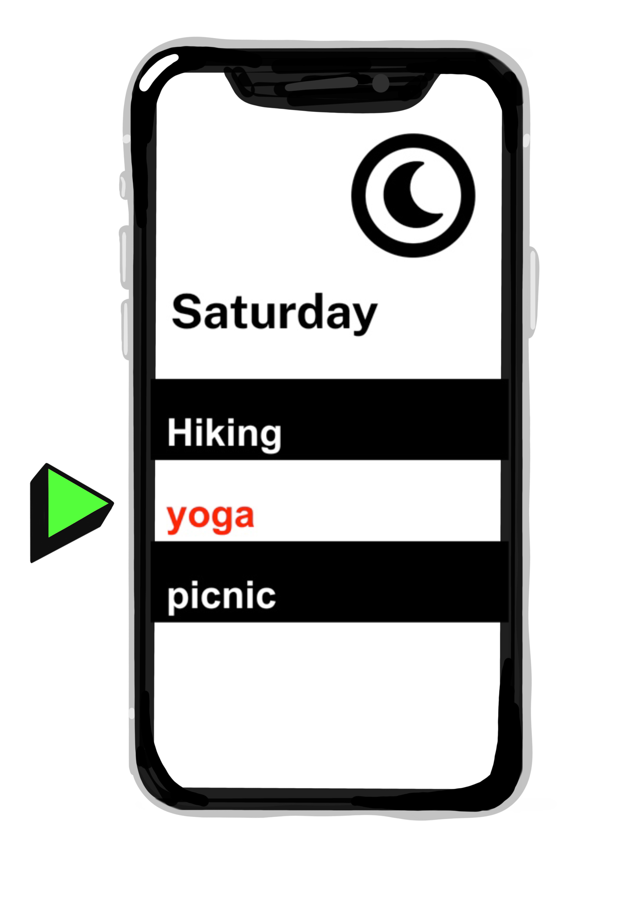
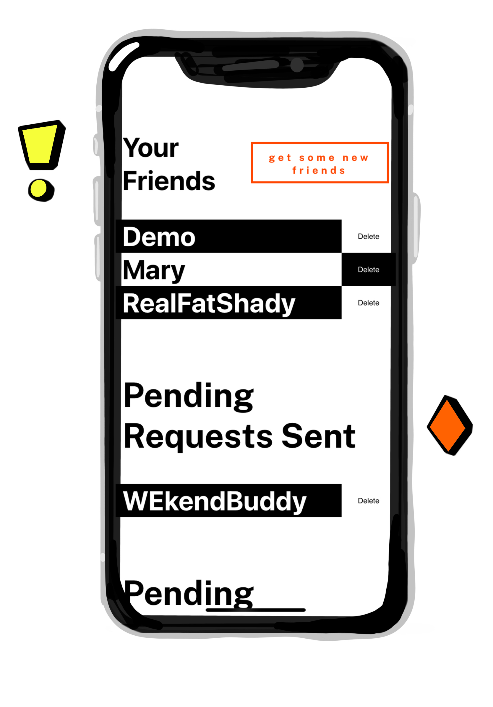
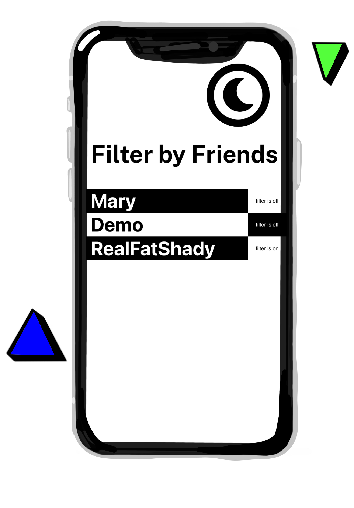

# WEkend🌴
A social app for posting casual weekend events and activities for your friends to see.

This repo is the front-end client, built in React.  You can see the app live at [https://wekend-client-ozharb.vercel.app/]

The app is meant for mobile use, but scales for desktop viewing.

To check out the app, I suggest you  account so you can see the onboarding experience.  But if you just want to view what the program looks like, you can use the demo account.

#### Demo Account Details

* user name: Demo
* password: Demo2021!

## Introduction

WEkend is a friendly weekend planning app for friends. Connect with friends, post events, and see what others are up to. 

Simple, quick, and awesome.

### User Stories

- User can:
* Register for a new account

## App Features

### See all the events you and your friends posted and get notified when any details change.

 See if an event detail has changed after you've RSPVed to be sure you're up to date with the latest info. Like in the screenshot above, the event 'yoga' is marked in red. This means you've RSVPed to an event, a detail about that event has changed, and you haven't opened up the event since. Once you open up the event, the event name will no longer be red. 

### Get all the important info you need in one place, including who's going to which events and who didn't see an update. 

Like in the screenshot above where the name Mary is marked in red, this means Mary RSVPed to an event then the host changed some detail about the event, and Mary hasn't opened up the event since the update. Once Mary opens up the event again, her name will no longer be red.

### Send friend requests and make friends to share your weekend with. 

Using a built in search feature, you can easily find other users by their user name, nickname, or full name.  

Send them a friend request and see the request pending on your friends pages until the accept. Once accepted, you can see all of eachothers events.

### Filter the events you see by who's hosting them  

Get a precise look at what's going on this weekend by using filters. Turn on all your friends filters to just get your events. Or keep them all off and know what eveyrone's doing for the ultimate weekend!

## Technology

#### Front End

* React
  * Create React App
  * React Router
* HTML5
* CSS3 (scratch - no frameworks)

#### Testing

* Jest (screen captures & smoke tests)

#### Production

* Deployed via Vercel

## Getting Started

Run `npm install` to load dependencies

Run `npm test` to ensure a stable build

The repo for the backend end server I've developed is available at https://github.com/ozharb/WEkend-api and is currently deployed on Heroku.

Deployments are handled through vercel and can be run via `npm run deploy`

This project was bootstrapped with [Create React App](https://github.com/facebook/create-react-app).

## Available Scripts

In the project directory, you can run:

### `npm start`

Runs the app in the development mode.\
Open [http://localhost:3000](http://localhost:3000) to view it in the browser.

The page will reload if you make edits.\
You will also see any lint errors in the console.

### `npm test`

Launches the test runner in the interactive watch mode.\
See the section about [running tests](https://facebook.github.io/create-react-app/docs/running-tests) for more information.

### `npm run build`

Builds the app for production to the `build` folder.\
It correctly bundles React in production mode and optimizes the build for the best performance.

The build is minified and the filenames include the hashes.\
Your app is ready to be deployed!

See the section about [deployment](https://facebook.github.io/create-react-app/docs/deployment) for more information.